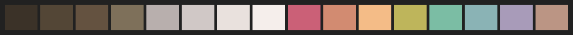
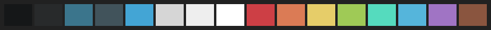

# base16-schemes

## Contributing

To submit your scheme, submit a new pull request to this repository with your
scheme yaml file.

## Imported Scheme Repositories

These are the original locations all schemes were imported from. (this list generated by `doc/generate_main_readme.sh` script)

Name | bg_212121
--- | ---
[black-metal-burzum](https://github.com/metalelf0) by metalelf0 | 
brushtrees by Abraham White <abelincoln.white@gmail.com> | 
[spacemacs](https://github.com/nashamri/spacemacs-theme) by Nasser Alshammari | 
[brewer](http://github.com/tpoisot) by Timothée Poisot | 
material by Nate Peterson | 
[solarized-light](modified by aramisgithub) by Ethan Schoonover | 
[atelier-sulphurpool-light](http://atelierbramdehaan.nl) by Bram de Haan | 
[heetch-light](tealeg@gmail.com) by Geoffrey Teale | 
[default-dark](http://chriskempson.com) by Chris Kempson | 
[shadesmear-dark](http://kyle.giammar.co) by Kyle Giammarco | 
emil by limelier | 
[atelier-plateau-light](http://atelierbramdehaan.nl) by Bram de Haan | 
[xcode-dusk](https://github.com/gonsie) by Elsa Gonsiorowski | 
primer-dark-dimmed by Jimmy Lin | 
equilibrium-dark by Carlo Abelli | 
apprentice by romainl | 
[tokyodark-terminal](https://github.com/tiagovla/) by Tiagovla | 
[atelier-cave](http://atelierbramdehaan.nl) by Bram de Haan | 
[windows-10-light](https://github.com/C-Fergus) by Fergus Collins | 
[summerfruit-dark](http://christop.club/) by Christopher Corley | 
gruber by Patel, Nimai <nimai.m.patel@gmail.com>, colors from www.github.com/rexim/gruber-darker-theme | 
[gruvbox-material-dark-hard](https://github.com/sainnhe/gruvbox-material-vscode) by Mayush Kumar | 
tokyo-night-terminal-storm by Michaël Ball | 
[onedark](http://github.com/tilal6991) by Lalit Magant | 
[tomorrow-night-eighties](http://chriskempson.com) by Chris Kempson | 
[da-one-white](https://github.com/NNBnh) by NNB | 
[porple](https://github.com/AuditeMarlow) by Niek den Breeje | 
[darkviolet](https://github.com/ruler501/base16-darkviolet) by ruler501 | 
[chalk](http://chriskempson.com) by Chris Kempson | 
[tender](https://github/com/jacoborus/tender.vim) by Jacobo Tabernero | 
[shadesmear-light](http://kyle.giammar.co) by Kyle Giammarco | 
[windows-95](https://github.com/C-Fergus) by Fergus Collins | 
[nova](https://trevordmiller.com) by George Essig | 
ayu-light by Khue Nguyen <Z5483Y@gmail.com> | 
[papercolor-light](https://github.com/NLKNguyen/papercolor-theme) by Jon Leopard | 
tokyo-city-dark by Michaël Ball | 
[gruvbox-material-dark-soft](https://github.com/sainnhe/gruvbox-material-vscode) by Mayush Kumar | 
[windows-nt](https://github.com/C-Fergus) by Fergus Collins | 
[framer](Maintained by Jesse Hoyos) by Framer | 
[decaf](https://github.com/alexmirrington) by Alex Mirrington | 
[black-metal-khold](https://github.com/metalelf0) by metalelf0 | 
[google-dark](http://sethawright.com) by Seth Wright | 
[circus](https://github.com/ewang12) by Stephan Boyer | 
[black-metal-bathory](https://github.com/metalelf0) by metalelf0 | 
[snazzy](https://github.com/sindresorhus/hyper-snazzy) by Chawye Hsu | 
[gruvbox-dark-hard](https://github.com/morhetz/gruvbox) by Dawid Kurek | 
[da-one-sea](https://github.com/NNBnh) by NNB | 
[atelier-dune](http://atelierbramdehaan.nl) by Bram de Haan | 
[papercolor-dark](https://github.com/NLKNguyen/papercolor-theme) by Jon Leopard | 
[black-metal-mayhem](https://github.com/metalelf0) by metalelf0 | 
darcula by jetbrains | 
[synth-midnight-dark](http://github.com/michael-ball/) by Michaël Ball | 
ayu-dark by Khue Nguyen <Z5483Y@gmail.com> | 
[pico](http://www.lexaloffle.com/pico-8.php) by PICO-8 | 
[atelier-heath](http://atelierbramdehaan.nl) by Bram de Haan | 
[gruvbox-material-light-soft](https://github.com/sainnhe/gruvbox-material-vscode) by Mayush Kumar | 
[icy](https://icyphox.ga) by icyphox | 
[atelier-cave-light](http://atelierbramdehaan.nl) by Bram de Haan | 
[phd](http://leetless.de/vim.html) by Hennig Hasemann | 
[horizon-terminal-light](http://github.com/michael-ball/) by Michaël Ball | 
material-vivid by joshyrobot | 
[gigavolt](http://github.com/Whillikers) by Aidan Swope | 
[shades-of-purple](https://github.com/ahmadawais/shades-of-purple-vscode.) by Iolar Demartini Junior | 
[harmonic16-light](https://github.com/janniks) by Jannik Siebert | 
[gruvbox-dark-soft](https://github.com/morhetz/gruvbox) by Dawid Kurek | 
[bright](http://chriskempson.com) by Chris Kempson | 
[black-metal-venom](https://github.com/metalelf0) by metalelf0 | 
[black-metal-dark-funeral](https://github.com/metalelf0) by metalelf0 | 
[railscasts](http://railscasts.com) by Ryan Bates | 
[marrakesh](http://github.com/Alexx2/) by Alexandre Gavioli | 
hardcore by Chris Caller | 
material-lighter by Nate Peterson | 
[gruvbox-material-light-hard](https://github.com/sainnhe/gruvbox-material-vscode) by Mayush Kumar | 
tokyo-city-terminal-light by Michaël Ball | 
[shapeshifter](http://tybenz.com) by Tyler Benziger | 
[embers](https://github.com/janniks) by Jannik Siebert | 
[sakura](http://github.com/Misterio77) by Misterio77 | 
material-palenight by Nate Peterson | 
[horizon-terminal-dark](http://github.com/michael-ball/) by Michaël Ball | 
[3024](http://github.com/idleberg) by Jan T. Sott | 
material-darker by Nate Peterson | 
[ocean](http://chriskempson.com) by Chris Kempson | 
[atelier-heath-light](http://atelierbramdehaan.nl) by Bram de Haan | 
[gruvbox-material-dark-medium](https://github.com/sainnhe/gruvbox-material-vscode) by Mayush Kumar | 
[darktooth](https://github.com/jasonm23) by Jason Milkins | 
purpledream by malet | 
[dracula](http://github.com/dracula) by Mike Barkmin | 
[brogrammer](http://github.com/piggyslasher) by Vik Ramanujam | 
[outrun-dark](http://github.com/hugodelahousse/) by Hugo Delahousse | 
bespin by Jan T. Sott | 
zenburn by elnawe | 
[rebecca](http://github.com/vic/rebecca-theme) by Victor Borja | 
vice by Thomas Leon Highbaugh thighbaugh@zoho.com | 
[sandcastle](https://github.com/gessig) by George Essig | 
[atelier-savanna](http://atelierbramdehaan.nl) by Bram de Haan | 
[atelier-estuary-light](http://atelierbramdehaan.nl) by Bram de Haan | 
[ia-dark](modified by aramisgithub) by iA Inc. | 
[atelier-lakeside](http://atelierbramdehaan.nl) by Bram de Haan | 
[gotham](arranged by Brett Jones) by Andrea Leopardi | 
oceanicnext by https://github.com/voronianski/oceanic-next-color-scheme | 
[black-metal-marduk](https://github.com/metalelf0) by metalelf0 | 
[everforest](https://github.com/sainnhe) by Sainnhe Park | 
[silk-dark](https://github.com/Misterio77) by Gabriel Fontes | 
stella by Shrimpram | 
[cupcake](http://chriskempson.com) by Chris Kempson | 
tokyo-night-light by Michaël Ball | 
rose-pine-moon by Emilia Dunfelt <sayhi@dunfelt.se> | 
[gruvbox-dark-medium](https://github.com/morhetz/gruvbox) by Dawid Kurek | 
[da-one-gray](https://github.com/NNBnh) by NNB | 
[greenscreen](http://chriskempson.com) by Chris Kempson | 
[katy](https://github.com/gessig) by George Essig | 
[summercamp](zoefiri.github.io) by zoe firi | 
[solarflare-light](https://chuck.harmston.ch) by Chuck Harmston | 
ayu-mirage by Khue Nguyen <Z5483Y@gmail.com> | 
[black-metal](https://github.com/metalelf0) by metalelf0 | 
github by Defman21 | 
codeschool by blockloop | 
[flat](http://chriskempson.com) by Chris Kempson | 
paraiso by Jan T. Sott | 
[macintosh](http://www.kreativekorp.com) by Rebecca Bettencourt | 
[atelier-forest-light](http://atelierbramdehaan.nl) by Bram de Haan | 
[windows-highcontrast](https://github.com/C-Fergus) by Fergus Collins | 
tokyo-city-light by Michaël Ball | 
[silk-light](https://github.com/Misterio77) by Gabriel Fontes | 
[solarflare](https://chuck.harmston.ch) by Chuck Harmston | 
[gruvbox-material-light-medium](https://github.com/sainnhe/gruvbox-material-vscode) by Mayush Kumar | 
[black-metal-nile](https://github.com/metalelf0) by metalelf0 | 
tokyo-city-terminal-dark by Michaël Ball | 
[da-one-ocean](https://github.com/NNBnh) by NNB | 
[twilight](https://github.com/hartbit) by David Hart | 
[horizon-dark](http://github.com/michael-ball/) by Michaël Ball | 
fruit-soda by jozip | 
[mocha](http://chriskempson.com) by Chris Kempson | 
mellow-purple by gidsi | 
[monokai](http://www.monokai.nl) by Wimer Hazenberg | 
seti | 
[atelier-seaside](http://atelierbramdehaan.nl) by Bram de Haan | 
tokyo-night-storm by Michaël Ball | 
[dirtysea](Kal Hodgson) by Kahlil | 
[grayscale-dark](https://github.com/Alexx2/) by Alexandre Gavioli | 
[kanagawa](https://github.com/rebelot) by Tommaso Laurenzi | 
[google-light](http://sethawright.com) by Seth Wright | 
qualia by isaacwhanson | 
[irblack](http://timotheepoisot.fr) by Timothée Poisot | 
[espresso](https://github.com/alexmirrington) by Unknown. Maintained by Alex Mirrington | 
zenbones by mcchrish | 
[summerfruit-light](http://christop.club/) by Christopher Corley | 
[ia-light](modified by aramisgithub) by iA Inc. | 
[windows-nt-light](https://github.com/C-Fergus) by Fergus Collins | 
[windows-highcontrast-light](https://github.com/C-Fergus) by Fergus Collins | 
equilibrium-light by Carlo Abelli | 
cupertino by Defman21 | 
[heetch](tealeg@gmail.com) by Geoffrey Teale | 
sagelight by Carter Veldhuizen | 
[harmonic16-dark](https://github.com/janniks) by Jannik Siebert | 
[synth-midnight-light](http://github.com/michael-ball/) by Michaël Ball | 
primer-dark by Jimmy Lin | 
[ashes](https://github.com/janniks) by Jannik Siebert | 
[unikitty-reversible](@joshwlewis) by Josh W Lewis | 
[woodland](https://jcornwall.com) by Jay Cornwall | 
[eighties](http://chriskempson.com) by Chris Kempson | 
[atelier-seaside-light](http://atelierbramdehaan.nl) by Bram de Haan | 
[eva-dim](https://github.com/kjakapat) by kjakapat | 
[blueforest](https://github.com/alonsodomin) by alonsodomin | 
[unikitty-light](@joshwlewis) by Josh W Lewis | 
[atelier-estuary](http://atelierbramdehaan.nl) by Bram de Haan | 
[helios](https://github.com/reyemxela) by Alex Meyer | 
[grayscale-light](https://github.com/Alexx2/) by Alexandre Gavioli | 
[pinky](https://github.com/b3nj5m1n) by Benjamin | 
materia by Defman21 | 
hopscotch by Jan T. Sott | 
[colors](http://clrs.cc) by mrmrs | 
equilibrium-gray-dark by Carlo Abelli | 
[atelier-dune-light](http://atelierbramdehaan.nl) by Bram de Haan | 
[classic-light](http://heeris.id.au) by Jason Heeris | 
equilibrium-gray-light by Carlo Abelli | 
primer-light by Jimmy Lin | 
[darkmoss](https://github.com/avanzzzi) by Gabriel Avanzi | 
[windows-95-light](https://github.com/C-Fergus) by Fergus Collins | 
[catppuccin](https://github.com/pocco81) by Pocco81 | 
tokyo-night-terminal-light by Michaël Ball | 
[nebula](https://github.com/Misterio77) by Gabriel Fontes | 
[edge-dark](https://github.com/cjayross) by cjayross | 
[tomorrow](http://chriskempson.com) by Chris Kempson | 
[atelier-savanna-light](http://atelierbramdehaan.nl) by Bram de Haan | 
[danqing](zhuwenhan950913@gmail.com) by Wenhan Zhu | 
[edge-light](https://github.com/cjayross) by cjayross | 
isotope by Jan T. Sott | 
nord by arcticicestudio | 
[eva](https://github.com/kjakapat) by kjakapat | 
[da-one-paper](https://github.com/NNBnh) by NNB | 
[humanoid-dark](tasmo Friese) by Thomas | 
mexico-light by Sheldon Johnson | 
[default-light](http://chriskempson.com) by Chris Kempson | 
[atlas](https://ajlende.com) by Alex Lende | 
[humanoid-light](tasmo Friese) by Thomas | 
tokyo-night-terminal-dark by Michaël Ball | 
[atelier-forest](http://atelierbramdehaan.nl) by Bram de Haan | 
blueish by Ben Mayoras | 
[windows-10](https://github.com/C-Fergus) by Fergus Collins | 
[tokyodark](https://github.com/tiagovla/) by Tiagovla | 
[da-one-black](https://github.com/NNBnh) by NNB | 
[uwunicorn](https://github.com/Misterio77) by Fernando Marques | 
[gruvbox-light-medium](https://github.com/morhetz/gruvbox) by Dawid Kurek | 
lime by limelier | 
[apathy](https://github.com/janniks) by Jannik Siebert | 
brushtrees-dark by Abraham White <abelincoln.white@gmail.com> | 
[atelier-lakeside-light](http://atelierbramdehaan.nl) by Bram de Haan | 
[pop](http://chriskempson.com) by Chris Kempson | 
tango by @Schnouki, based on the Tango Desktop Project | 
[unikitty-dark](@joshwlewis) by Josh W Lewis | 
rose-pine by Emilia Dunfelt <sayhi@dunfelt.se> | 
[danqing-light](zhuwenhan950913@gmail.com) by Wenhan Zhu | 
[gruvbox-light-hard](https://github.com/morhetz/gruvbox) by Dawid Kurek | 
[black-metal-immortal](https://github.com/metalelf0) by metalelf0 | 
[classic-dark](http://heeris.id.au) by Jason Heeris | 
[kimber](https://github.com/akhsiM) by Mishka Nguyen | 
[atelier-plateau](http://atelierbramdehaan.nl) by Bram de Haan | 
[atelier-sulphurpool](http://atelierbramdehaan.nl) by Bram de Haan | 
[tomorrow-night](http://chriskempson.com) by Chris Kempson | 
rose-pine-dawn by Emilia Dunfelt <sayhi@dunfelt.se> | 
[one-light](http://github.com/purpleKarrot) by Daniel Pfeifer | 
[horizon-light](http://github.com/michael-ball/) by Michaël Ball | 
vulcan by Andrey Varfolomeev | 
[pasque](https://github.com/Misterio77) by Gabriel Fontes | 
[black-metal-gorgoroth](https://github.com/metalelf0) by metalelf0 | 
tokyo-night-dark by Michaël Ball | 
[gruvbox-dark-pale](https://github.com/morhetz/gruvbox) by Dawid Kurek | 
[gruvbox-light-soft](https://github.com/morhetz/gruvbox) by Dawid Kurek | 
[spaceduck](https://github.com/Misterio77) by Guillermo Rodriguez | 
[solarized-dark](modified by aramisgithub) by Ethan Schoonover | 
[still-alive](derrick.mckee@gmail.com) by Derrick McKee | 
tube by Jan T. Sott | 
pandora by Cassandra Fox | 

[**Old Unclaimed Schemes**](https://github.com/chriskempson/base16-unclaimed-schemes) - If your scheme is in this repository, please give it a new home!

## FAQ

***Where did these all come from?***

These schemes were originally imported from [the old schemes source repo](https://github.com/chriskempson/base16-schemes-source) on May 25th, 2022 around 11pm UTC.

***Why is it all in one repo now?***

Spec 0.10 was merged at the same time that base16 was forked from [Chris Kempson's](https://github.com/chriskempson) account. One of the changes of this version was moving all schemes to a single repo rather than separate repos and the fork was chosen as a convenient time to do this.

## Contributors

- Antoine Cotten
- Bao
- Bruno Adelé
- CosmosAtlas
- Gabriel Fontes
- Jonathan Lorimer
- Josh Goebel
- Kaleb Elwert
- NNB